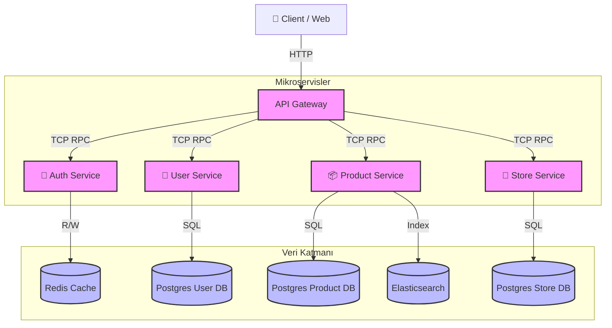

# 🚀 E-Commerce Microservices (NestJS Monorepo)

<div align="center">


<p align="center">
  <strong>NestJS Monorepo mimarisi ile geliştirilmiş, ölçeklenebilir e-ticaret altyapısı.</strong>
  <br />
  Auth, User ve Product servisleri izole veritabanları ile çalışır.
</p>

[Özellikler](#-özellikler) •
[Mimari](#-proje-mimarisi) •
[Kurulum](#-kurulum-ve-çalıştırma-local) •
[Servisler](#-servis-durumları-ve-portlar) •
[Roadmap](#-future-roadmap-gelecek-planları) •
[Katkıda Bulunma](#-katkıda-bulunma)

</div>

---

## ✨ Özellikler

- 🏗 **Database-per-Service Pattern** - Her servis kendi veritabanını yönetir
- 🔐 **JWT Authentication** - Güvenli kimlik doğrulama ve token yönetimi
- 🐳 **Docker Ready** - Konteyner tabanlı altyapı
- 📡 **TCP RPC Communication** - Servisler arası senkron iletişim
- 🎯 **TypeScript** - Tip güvenli kod geliştirme
- 🔄 **Prisma ORM** - Modern veritabanı yönetimi
- 🔍 **Elasticsearch Integration** - Gelişmiş ürün arama ve filtreleme
- 🚀 **Scalable Architecture** - Ölçeklenebilir mikroservis mimarisi

---

## 🏗 Proje Mimarisi

Bu proje, **Database-per-Service** pattern'i kullanılarak tasarlanmıştır. Servisler arası iletişim şu aşamada **TCP (NestJS RPC)** protokolü ile senkron olarak sağlanmaktadır.



---

## 📦 Servis Durumları ve Portlar

| Servis              | Durum             | Port | Açıklama                                          |
| ------------------- | ----------------- | ---- | ------------------------------------------------- |
| **API Gateway**     | ✅ Aktif          | 3000 | Tüm isteklerin giriş kapısı, Routing & Validation |
| **Auth Service**    | ✅ Aktif          | 3001 | JWT Yönetimi, Login/Register işlemleri            |
| **User Service**    | 🚧 Geliştiriliyor | 3002 | Kullanıcı kayıt, doğrulama ve profil yönetimi     |
| **Product Service** | ✅ Aktif          | 3003 | Ürün CRUD, Elasticsearch sync ve stok yönetimi    |
| **Order Service**   | ⏳ Planlandı      | 3004 | Sipariş oluşturma ve yönetim süreçleri            |
| **Payment Service** | ⏳ Planlandı      | 3005 | Ödeme gateway entegrasyonları                     |
| **Store Service**   | 🚧 Geliştiriliyor | 3006 | Mağaza yönetimi ve satış süreçleri                |

---

## 🔮 Future Roadmap (Gelecek Planları)

Projenin **Phase 2** aşamasında asenkron mimariye geçiş hedeflenmektedir:

- [ ] **Apache Kafka Entegrasyonu** - `order.created`, `product.updated` gibi eventlerin asenkron taşınması
- [ ] **RabbitMQ** - Mail gönderimi gibi background task'ların yönetimi
- [ ] **Elasticsearch Optimizasyonları** - Aggregation, autocomplete, synonym filter gibi gelişmiş özellikler
- [ ] **Grafana & Prometheus** - Servislerin anlık izlenmesi (Monitoring)
- [ ] **Circuit Breaker Pattern** - Hata toleransı ve dayanıklılık
- [ ] **API Rate Limiting** - DDoS koruması ve trafik yönetimi
- [ ] **Distributed Tracing** - Jaeger/Zipkin ile request izleme
- [ ] **API Gateway Cache Layer** - Redis ile response caching
- [ ] **Order & Payment Integration** - Sipariş ve ödeme servislerinin tamamlanması

---

## 📂 Dizin Yapısı (Monorepo)

```
api-for-ecommerce-website/
├── apps/                      # Tüm mikroservisler
│   ├── auth/                  # 🔐 Authentication Service
│   ├── e-commerce/            # 🌐 API Gateway (HTTP Entry Point)
│   ├── order/                 # 📦 Order Service (Geliştiriliyor)
│   ├── payment/               # 💳 Payment Service (Planlanıyor)
│   ├── product/               # 🛍️ Product Service + Elasticsearch
│   ├── store/                 # 🏪 Store Service (Geliştiriliyor)
│   └── user/                  # 👤 User Service
├── docker/                    # Docker konfigürasyonları ve Dockerfile'lar
├── libs/                      # Paylaşılan kütüphaneler
│   └── contracts/             # Ortak DTO'lar, Interface'ler ve Event Pattern'leri
├── node_modules/              # NPM bağımlılıkları
├── .dockerignore              # Docker ignore kuralları
├── .env                       # Environment variables (⚠️ gitignore'da!)
├── .gitignore                 # Git ignore kuralları
├── .prettierrc                # Prettier konfigürasyonu
├── docker-compose.yml         # Altyapı orchestration (Postgres, Redis, ES)
├── eslint.config.mjs          # ESLint konfigürasyonu
├── init-dbs.sh                # Database initialization script
├── nest-cli.json              # NestJS CLI konfigürasyonu
├── package.json               # Root bağımlılıklar ve scripts
├── package-lock.json          # Lock file
├── README.md                  # Bu dosya
├── tsconfig.build.json        # TypeScript build config
└── tsconfig.json              # TypeScript config
```

### 📁 Servis Dizin Yapısı Örneği

```
apps/product/
├── prisma/
│   └── schema.prisma          # Product DB şeması
├── search/
│   └── search.service.ts      # Elasticsearch entegrasyonu
├── src/
│   ├── controllers/           # HTTP ve RPC Controllers
│   ├── product.service.ts     # Business Logic
│   │
│   │── product.module.ts
│   └── main.ts                # Service entry point
└── test/                      # Test dosyaları
```

---

## 🔧 Teknoloji Yığını

### Backend Framework

- **NestJS v10** - Progressive Node.js framework
- **TypeScript 5.x** - Type-safe development

### Veritabanı & Cache

- **PostgreSQL 16** - İlişkisel veritabanı (per-service)
- **Prisma ORM** - Modern ORM ve migration aracı
- **Redis 7** - Token blacklist ve cache yönetimi
- **Elasticsearch 8** - Ürün arama ve filtreleme

### İletişim & Messaging

- **TCP (NestJS RPC)** - Mikroservisler arası senkron iletişim
- **REST API** - Client-Gateway iletişimi
- **(Planned) Apache Kafka** - Event-driven architecture
- **(Planned) RabbitMQ** - Background job processing

### DevOps & Tools

- **Docker & Docker Compose** - Konteynerizasyon
- **Git** - Versiyon kontrolü
- **ESLint & Prettier** - Code quality
- **Jest** - Testing framework

---

## 🔐 Environment Variables

Her servis için gerekli environment değişkenlerini `.env` dosyasında tanımlayın.

## 🔍 Elasticsearch Kullanımı

Product Service, Elasticsearch ile entegre çalışarak gelişmiş arama ve filtreleme özellikleri sunar.

### Mevcut Özellikler

- ✅ Full-text search (fuzzy matching)
- ✅ Multi-field search (title, description, SKU, brand, category)
- ✅ Price range filtering
- ✅ Category & brand filtering
- ✅ Stock availability filtering
- ✅ Dynamic attribute filtering (nested queries)
- ✅ Multiple sort options (price, relevance, date)
- ✅ Pagination support

### Örnek Search Request

```typescript
// Product search with filters
GET /products/search
{
  "query": "laptop",
  "categoryId": 5,
  "brandIds": [1, 3],
  "minPrice": 5000,
  "maxPrice": 15000,
  "attributes": {
    "RAM": ["8GB", "16GB"],
    "Storage": ["512GB SSD"]
  },
  "inStock": true,
  "sort": "PRICE_ASC",
  "page": 1,
  "limit": 20
}
```

---

## ⚠️ Önemli Notlar

> 🚧 **Bu proje geliştirme aşamasındadır.**

---

## 📄 Lisans

Bu proje [MIT](LICENSE) lisansı altında lisanslanmıştır.

---

## 📧 İletişim

- **Maintainer:** [@Ekinkaratas](https://github.com/Ekinkaratas)

---

<div align="center">

**[⬆ Başa Dön](#-e-commerce-microservices-nestjs-monorepo)**

---

<sub>Made with ❤️ using NestJS Monorepo Architecture</sub>

</div>
